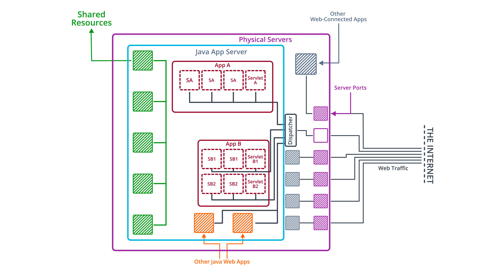
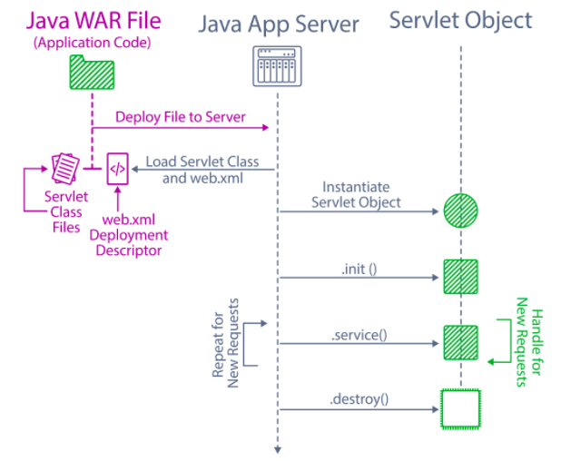

# Java Web Developer Nanodegree Course Notes

## Course Notes
### Chap 1 Introduction to Spring Boot

#### MyBatis vs Hibernate
- Hibernate and MyBatis are both compatible with the Spring framework.
- Hibernate is an object-relational mapping framework (ORM) which maps **Java classes** to database tables.
- MyBatis is a persistence framework – not ORM, which maps **SQL statements** to Java methods.

### Chap 2 Web Development in Java
#### Java Application Server
-  A program that hosts other applications, forwarding incoming requests to the appropriate application according to a filter. Provides shared access to resources and multi-threading.
- It automatically handles multiple client connections simultaneously.
- It can be configured to forward requests with custom logic.
- It can share heavyweight or universal components with each of its applications.

#### Tomcat
- Apache Tomcat is an open-source implementation of the Java Servlet, JavaServer Pages, Java Expression Language and WebSocket technologies.
- Tomcat provides a "pure Java" **HTTP web server** environment in which Java code can run.

#### Servlets
- All Java Web Application are built on this foundational technology
- Servlets are the interface between an application and the Java Application server it runs on .
- `web.xml` provide the reference to the servlets. It maps the specific request paths to specific servlets.
- The Java App server use reflection API instantiate servlets class.
- First call the `.init()` method to trigger initialization.
- Then, call the `.service()` method to handle incoming request.
- In the end, call the `.destroy()` method to cleanup.

#### IoC
- Invert the control flow, instead of me handling the lifecycle of objects, the Spring context will take care of it. And it basically achieved by Dependency Injection. It allows Spring to manage instances of dependencies and provide them when needed.
- A good rule of thumb to decide which is which is the **new** keyword test. A component should never be manually instantiated with the new keyword - components are managed by Spring, which means we need to rely on dependency injection to get a component reference.

#### Onion Architecture
- An architectural pattern in which an application is separated into nested layers. In order for a request to be processed by the application, it must first travel through an outer layer of external interfaces and controllers, then through a middle layer of services and business logic, and finally through a persistence layer of data access objects. The separation of these layers emphasizes clean separation of concerns.

### Controller Model objects
- Every controller method can take an optional Model argument, and by reading and changing the data inside of it, the controller can read user-submitted data and populate the template with the changes. Think of the Model class a simple data-transfer object: something that can store various bits of data with keys to look that data up, and that can be passed between the browser, the template engine, and the controller to facilitate the transfer of data between the user and the application.

### Form-Backing Object
- This is a term used by Spring MVC and Thymeleaf to mean an object that represents the data contained in a form. On the Spring side, this is usually an additional argument to the relevant Controller method, and on the Thymeleaf side, this is referred to in the th:object attribute on the form.
